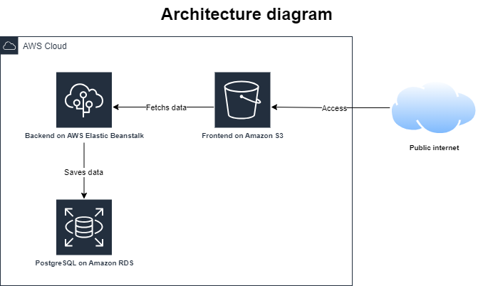

# Document

This document outlines the infrastructure components utilized to host our application on Amazon Web Services (AWS). It includes a high-level overview of the services employed for the API, frontend, and database.

## Services Used:
**Amazon Relational Database Service (RDS)**:  A fully managed database service that provides a scalable, reliable, and cost-effective solution for our application's data storage needs.

**Amazon Simple Storage Service (S3)**: In this deployment, S3 serves as the foundation for our static website. It provides highly scalable and durable storage for all the website's assets, including images, videos, HTML files, CSS, and JavaScript. This ensures website content remains readily available and accessible to users worldwide.

**AWS Elastic Beanstalk**:  A deployment service that simplifies provisioning and managing application servers. It handles scaling and load balancing, allowing for a focus on development.

## Architecture Diagram:

The diagram suggests the following data flow:

- Users interact with the application's frontend elements accessible over the public internet.
- User interaction might trigger communication between the frontend and the backend on Elastic Beanstalk.
- The backend might retrieve data from the PostgreSQL database on Amazon RDS.
- The backend may process information and potentially send data back to the frontend to update the user interface.