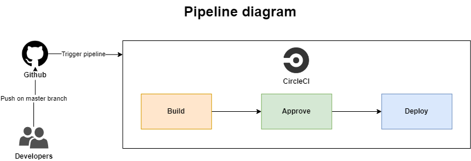

# Document

Overall, this [CI/CD pipeline](../.circleci/config.yml) automates building and deploying a web application. The build job happens whenever there's a code change, while deployment requires manual approval for an extra layer of control.

## Orbs:

These are reusable sets of commands (recipes) for common tasks like installing Node.js, AWS CLI, etc. This promotes code reuse and simplifies the pipeline definition.

## Jobs:

The pipeline defines two jobs: **build** and **deploy**.
- **build**: This job focuses on building the application. It uses a Docker image with Node.js 14.15 and performs the following steps:
  - Installs Node.js using the node/install orb.
Checks out the code from the version control system (e.g., Git).
  - Installs dependencies for the frontend application using `npm run frontend:install`.
  - Installs dependencies for the API using `npm run api:install`.
  - Builds the frontend using `npm run frontend:build`.
  - Builds the API using `npm run api:build`.
- **deploy**: This job deploys the built application. It uses a different Docker image and performs the following:
  - Installs Node.js 14.15 using the node/install orb.
  - Sets up the AWS CLI and Elastic Beanstalk configurations using the respective orbs (eb/setup and aws-cli/setup).
  - Checks out the code again (potentially for deployment scripts).
  - Runs the deployment script `npm run deploy` which likely uploads the built frontend and backend code to the AWS Elastic Beanstalk environment and AWS S3.

## Workflows:

The pipeline defines a workflow named udagram. This workflow specifies the order of job execution.
- The workflow first runs the build job.
- Then, it introduces a manual approval step named hold. This step requires manual approval before proceeding further, likely for a quality check before deployment. It only triggers on the master branch.
- After manual approval, the deploy job runs, deploying the application to the AWS Elastic Beanstalk environment.